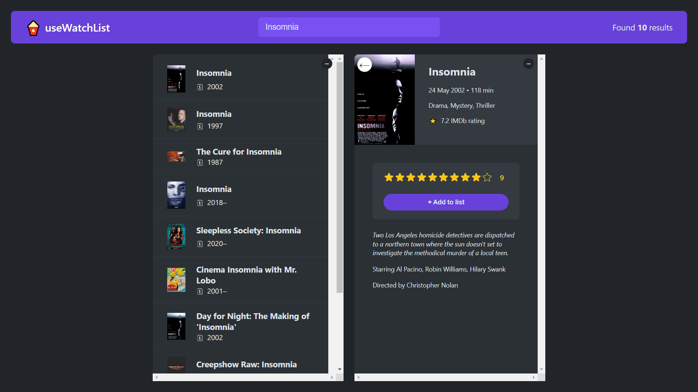
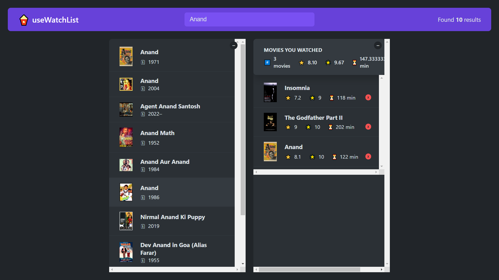

# useWatchList

Welcome to useWatchList!

## Description

useWatchList is a React project built using Vite. It helps users keep track of their watchlists for movies, TV shows, or any other content they want to remember. With useWatchList, you can easily add, remove, and manage items on your watchlist.

## Live Demo

To see useWatchList in action, visit [useWatchList Demo](https://usewatchlists.netlify.app/).

## Demo Pictures

## Features

- **Add to Watchlist**: Easily add items to your watchlist with a simple interface.
- **Remove from Watchlist**: Remove items from your watchlist when you're done.
- **Responsive Design**: Enjoy a seamless experience on various devices and screen sizes.

## Technologies Used

- **React**: A JavaScript library for building user interfaces.
- **Vite**: A next-generation front-end tooling that builds faster and leaner projects.

## Usage

1. Clone the repository.
2. Run `npm install` to install dependencies.
3. Run `npm run dev` to start the development server.
4. Open your browser and navigate to `http://localhost:3000` to view useWatchList.

## Contributing

Contributions are welcome! If you'd like to contribute to useWatchList, please follow these steps:

1. Fork the repository.
2. Create a new branch (`git checkout -b feature/your-feature`).
3. Make your changes.
4. Commit your changes (`git commit -am 'Add some feature'`).
5. Push to the branch (`git push origin feature/your-feature`).
6. Create a new Pull Request.

## Issues and Feedback

If you encounter any issues or have feedback, please feel free to open an issue on GitHub. Your feedback is highly appreciated and will help improve useWatchList.

## Acknowledgements

Special thanks to [Vite](https://vitejs.dev/) and [React](https://reactjs.org/) for making this project possible.

## License

This project is licensed under the MIT License - see the [LICENSE](LICENSE) file for details.
